# 🤖 Artificial Intelligence Techniques — VTU 29665

A practical collection of **Artificial Intelligence techniques implemented in Python** for the VTU course **10212CS211 – Artificial Intelligence Techniques (VTU29665)**.

The repository contains programs covering graph search, local search, heuristic search, game-tree search, swarm intelligence, and constraint satisfaction. The current `main` branch contains **8 Python programs**. citeturn0view0

---

## 🗺️ Visual Repository Map

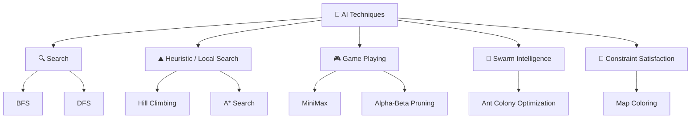

---

# 📂 Repository Files

| Task | File | AI Technique |
|---|---|---|
| Task 1(a) | `task 1(a).py` | Breadth-First Search (BFS) |
| Task 1(b) | `task 1(b).py` | Depth-First Search (DFS) |
| Task 2 | `task 2.py` | Hill Climbing for TSP |
| Task 3(a) | `task 3(a).py` | A* Search |
| Task 3(b) | `task 3(b).py` | A* Search |
| Task 4 | `task-4.py` | Mini-Max with Alpha-Beta Pruning |
| Task 5 | `task-5.py` | Ant Colony Optimization |
| Task 6 | `task-6.py` | Map Coloring using Backtracking |

The filenames and task structure are taken directly from the repository. citeturn0view0

---

# 🔍 Task 1(a) — Breadth-First Search

**File:** `task 1(a).py`

The program represents a graph using an adjacency dictionary and performs BFS using Python's `deque`. It starts from node `A`, removes nodes from the front of the queue, records visited nodes, and adds adjacent nodes to the queue. citeturn1view0

### Visual Flow

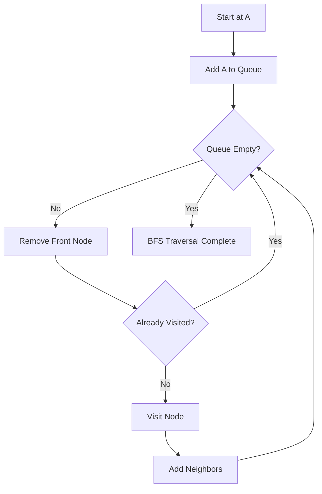

### Graph Used

```text
        A
       / \
      B   C
     / \   \
    D   E   F
         \
          F
```

### Key Concept

**BFS explores nodes level by level.**

---

# 🔎 Task 1(b) — Depth-First Search

**File:** `task 1(b).py`

This program uses recursive DFS on the same graph structure. A node is marked visited and its neighbors are explored recursively. citeturn1view1

### Visual Flow

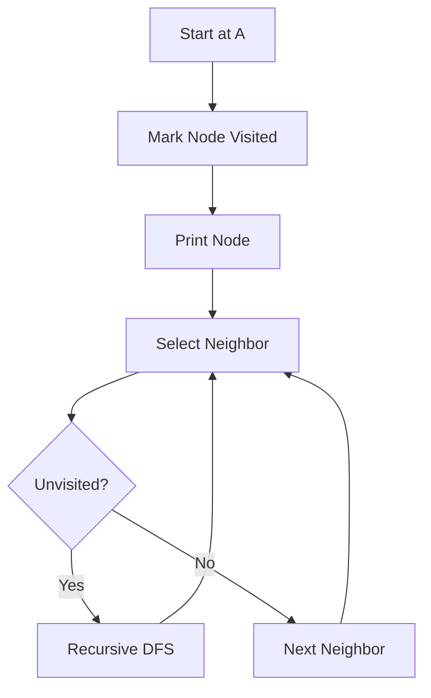

### BFS vs DFS

| Feature | BFS | DFS |
|---|---|---|
| Strategy | Level by level | Go deep first |
| Data Structure | Queue | Recursion / Stack |
| Repository File | `task 1(a).py` | `task 1(b).py` |

---

# ⛰️ Task 2 — Hill Climbing for TSP

**File:** `task 2.py`

The program applies a hill-climbing approach to a small Traveling Salesman Problem. It defines a distance/cost matrix, calculates the cost of a complete route including the return to the starting city, and searches for an improved route by swapping path positions. citeturn1view2

### Visual Flow

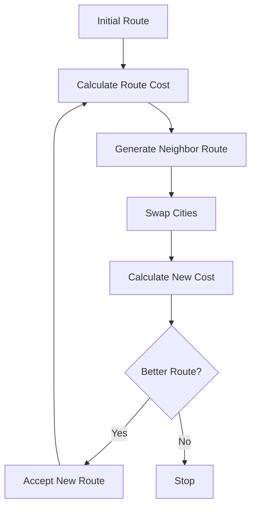

### Problem Representation

```text
A ──10── B
│       /│
15     35 25
│   /     │
C ──30── D
```

The program uses a four-location distance matrix and a route-cost function that includes the return to the starting location. citeturn1view2

### Core Idea

```text
Current Solution
       ↓
Generate Neighbor
       ↓
Compare Cost
       ↓
Move to Better Solution
       ↓
Repeat Until No Improvement
```

---

# ⭐ Task 3(a) — A* Search

**File:** `task 3(a).py`

This program implements A* search using a `PriorityQueue`. It maintains graph edge costs and heuristic values, then prioritizes nodes using:

```text
f(n) = g(n) + h(n)
```

The program searches from `A` to `G` and prints the resulting path and cost. citeturn2view0

### Visual Flow

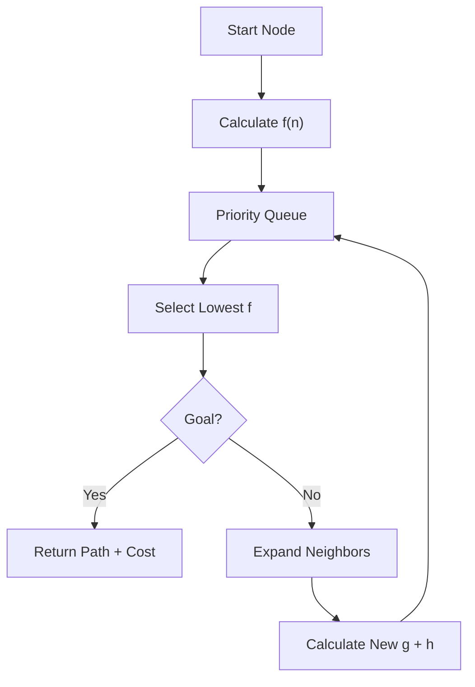

### A* Formula

```text
f(n) = g(n) + h(n)

g(n) = Cost from Start
h(n) = Estimated Cost to Goal
f(n) = Total Priority
```

---

# ⭐ Task 3(b) — A* Search Variation

**File:** `task 3(b).py`

This is another A* implementation using a priority queue. It uses a weighted graph, heuristic values, accumulated path cost `g`, and priority `g + h`. citeturn2view1

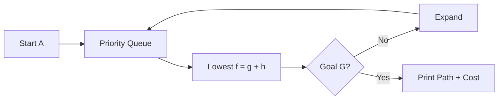

### Why A*?

A* combines:

```text
Actual Cost + Estimated Future Cost
```

This helps guide the search toward the goal instead of exploring every possible path blindly.

---

# 🎮 Task 4 — Mini-Max with Alpha-Beta Pruning

**File:** `task-4.py`

This program implements a **Mini-Max algorithm with Alpha-Beta pruning** for a small treasure-hunt game tree. The tree contains maximizing and minimizing levels, while alpha and beta values are updated to eliminate branches that cannot affect the final result. citeturn2view2

### Visual Flow

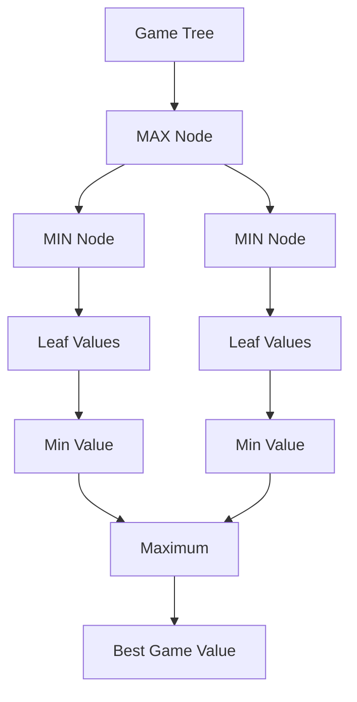

### Alpha-Beta Pruning

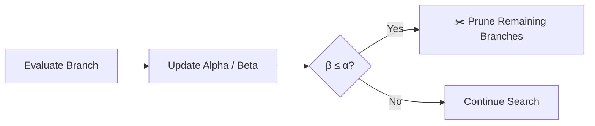

### Key Concepts

- Game trees
- MAX player
- MIN player
- Alpha
- Beta
- Pruning
- Optimal decision making

---

# 🐜 Task 5 — Ant Colony Optimization

**File:** `task-5.py`

This program applies **Ant Colony Optimization (ACO)** to a small route-optimization problem. It defines travel distances, multiple ants, iterations, pheromone values, evaporation, and heuristic parameters. Routes are constructed probabilistically and pheromone trails are updated to guide later iterations. citeturn2view3

### Visual Flow

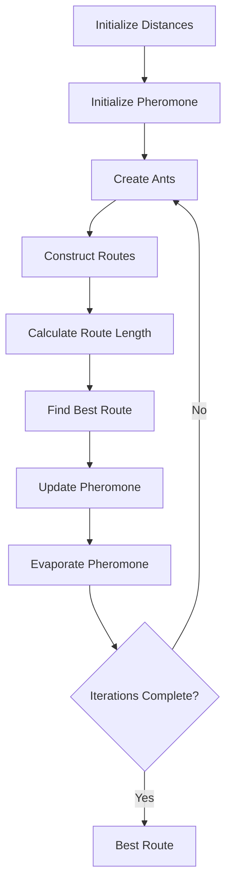

### ACO Parameters in the Program

```text
Ants        = 10
Iterations  = 50
Evaporation = 0.5
Alpha       = 1
Beta        = 2
Pheromone   = 1.0
```

These parameter values are defined directly in `task-5.py`. citeturn2view3

### Core Idea

```text
Ants
 ↓
Explore Routes
 ↓
Shorter Routes Receive Stronger Pheromone
 ↓
Future Ants Prefer Stronger Trails
 ↓
Repeated Iterations
 ↓
Better Route
```

---

# 🎨 Task 6 — Map Coloring

**File:** `task-6.py`

This program solves a map-coloring constraint satisfaction problem using **backtracking**. It defines four colors and a graph of five zones. A color is assigned only when it does not conflict with neighboring zones. citeturn2view4

### Visual Flow

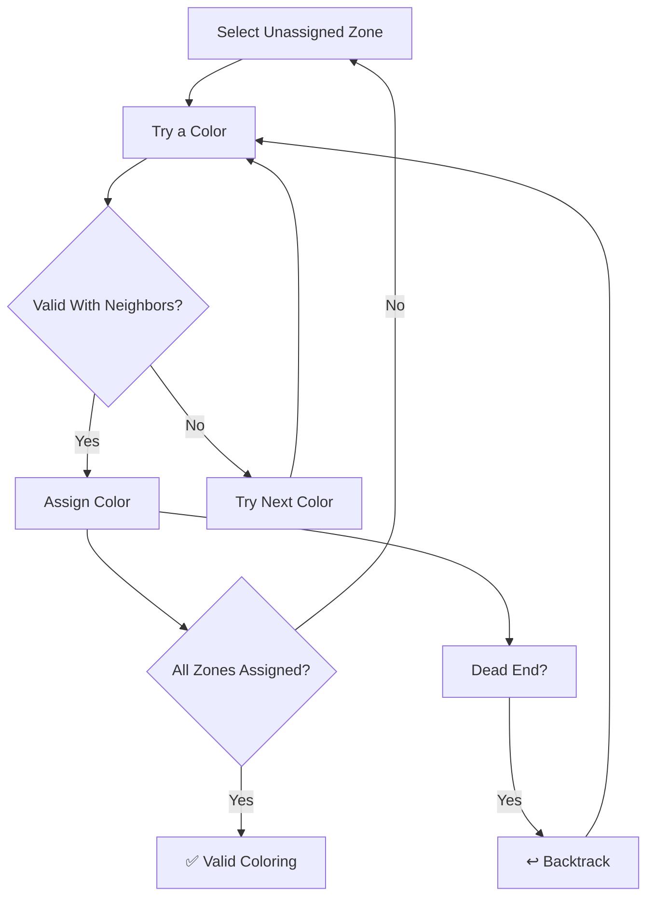

### Colors Used

```text
🔴 Red
🟢 Green
🔵 Blue
🟡 Yellow
```

### Graph

```text
       A
      / \
     B---C
     | \ / \
     |  X   E
     D-----E
```

The actual adjacency relationships are defined in the Python program and the solver checks neighboring assignments before accepting a color. citeturn2view4

---

# 🧠 AI Techniques Covered

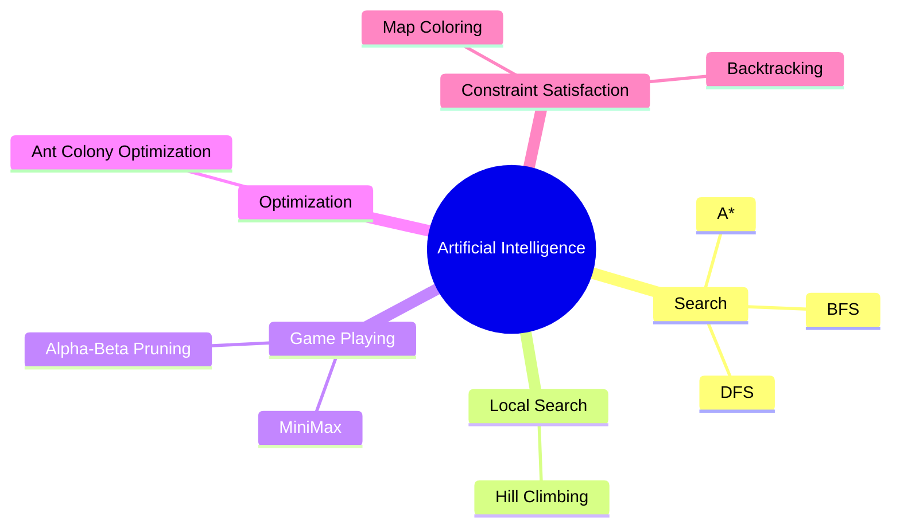

---

# 📊 Algorithm Comparison

| Algorithm | Category | Main Idea |
|---|---|---|
| BFS | Uninformed Search | Explore level by level |
| DFS | Uninformed Search | Explore depth first |
| Hill Climbing | Local Search | Move toward a better neighboring solution |
| A* | Informed Search | Use `g(n) + h(n)` |
| Mini-Max | Game Search | Choose optimal move against an opponent |
| Alpha-Beta | Game Optimization | Prune unnecessary game-tree branches |
| ACO | Swarm Intelligence | Use pheromone trails to improve routes |
| Backtracking | CSP | Assign, validate, and undo when necessary |

---

# 🔄 Learning Progression


---

# 🛠️ Technologies Used

```text
🐍 Python
📚 Python Standard Library
💻 VS Code / PyCharm / IDLE
🔧 Git
🐙 GitHub
```

The programs use Python standard-library components such as `deque`, `PriorityQueue`, and `random`. citeturn1view0turn2view0turn2view3

---

# 🚀 How to Run

## 1. Clone the repository

```bash
git clone https://github.com/Betha-hemanth/10212CS211_ARTIFICIAL-INTELLIGENCE-TECHNIQUES_-VTU29665-.git
```

## 2. Open the project

```bash
cd 10212CS211_ARTIFICIAL-INTELLIGENCE-TECHNIQUES_-VTU29665-
```

## 3. Run a task

Because some filenames contain spaces and parentheses, quote the filename when needed:

```bash
python "task 1(a).py"
python "task 1(b).py"
python "task 2.py"
python "task 3(a).py"
python "task 3(b).py"
python "task-4.py"
python "task-5.py"
python "task-6.py"
```

---

# 🎯 Learning Objectives

This repository provides hands-on practice with:

- Graph traversal
- Uninformed search
- Heuristic search
- Local optimization
- Game-tree decision making
- Alpha-Beta pruning
- Swarm intelligence
- Constraint satisfaction
- Backtracking
- Python implementation of AI algorithms

---

# 📈 AI Problem-Solving Pipeline

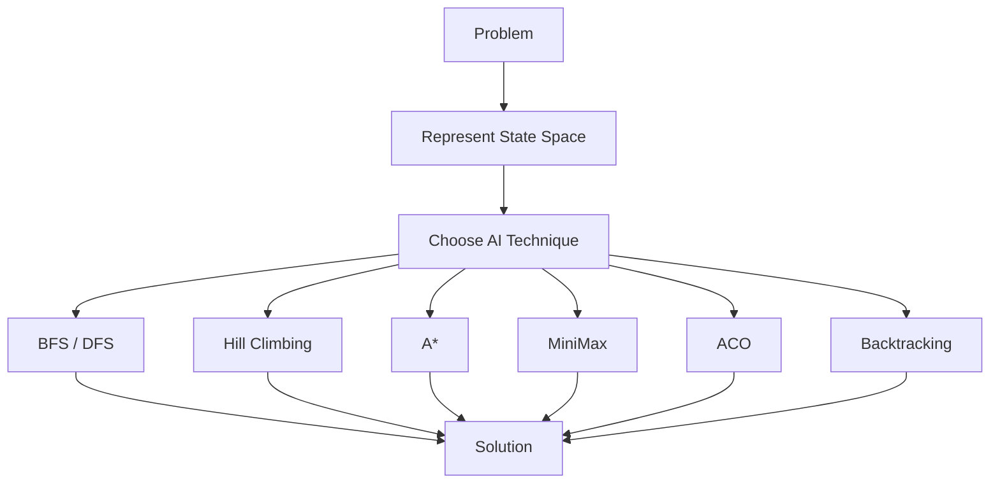

---

# 🔮 Future Improvements

Possible extensions for this repository:

- Uniform Cost Search
- Greedy Best-First Search
- Iterative Deepening DFS
- Dijkstra's Algorithm
- Genetic Algorithms
- Simulated Annealing
- More CSP problems
- Sudoku using Backtracking
- N-Queens
- Larger A* pathfinding examples
- More game-playing examples
- Visualization of search algorithms

---

# 👨‍💻 Author

**Betha Hemanth**

Artificial Intelligence Techniques — VTU Practice

---

⭐ If this repository helps you learn AI algorithms, consider giving it a star!

